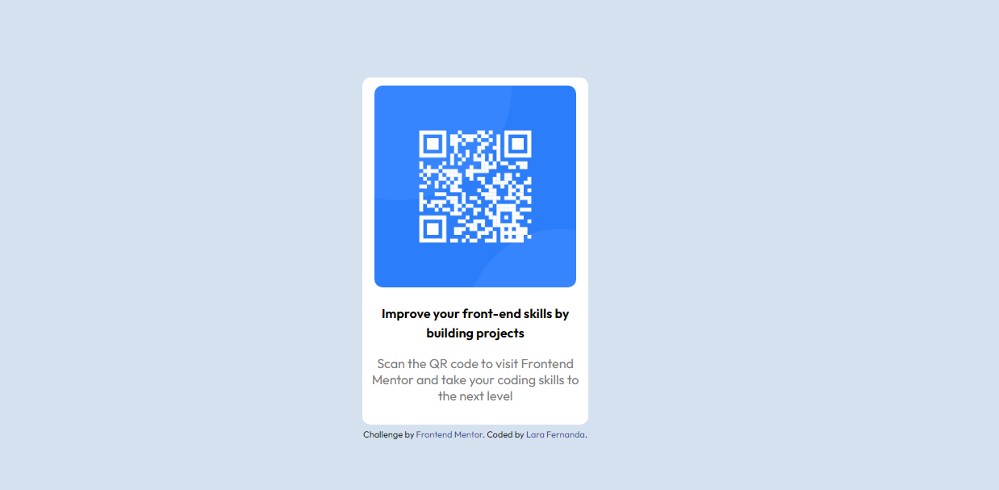

# Frontend Mentor - QR code component solution

This is a solution to the [QR code component challenge on Frontend Mentor](https://www.frontendmentor.io/challenges/qr-code-component-iux_sIO_H). Frontend Mentor challenges help you improve your coding skills by building realistic projects. 

## Table of contents

- [Overview](#overview)
  - [Screenshot](#screenshot)
  - [Links](#links)
- [My process](#my-process)
  - [Built with](#built-with)
  - [What I learned](#what-i-learned)
  - [Continued development](#continued-development)
  - [Useful resources](#useful-resources)
- [Author](#author)

## Overview
### Screenshot

### Links
- Solution URL: https://github.com/larafernanda/qr-code-component

## My process
### Built with
- Semantic HTML5 markup
- CSS custom properties
- Image color picker

### What I learned
Well, I already had some basic knowledge with HTML5/CSS3 so everything kinda ran smoothly, but man, I made just a noob mistake who had me stuck in code for like 2 hours and all because I wrote .body (as a class) instead of body in my CSS sheet. I was almost giving up Web Development career. Lol.
Overall, I tried my best to use my own website measures, even tho I honestly just mess around with margin and padding until they look acceptable.

### Continued development
I want to learn more about how to make responsive layouts, not just that initial viewport tag. I didn't try to make my layout mobile friendly because I have really no clue. Tips appreciated.

### Useful resources
- https://imagecolorpicker.com/ - This website helped me get the background-color.

## Author
- Frontend Mentor - [@larafernanda](https://www.frontendmentor.io/profile/larafernanda)
